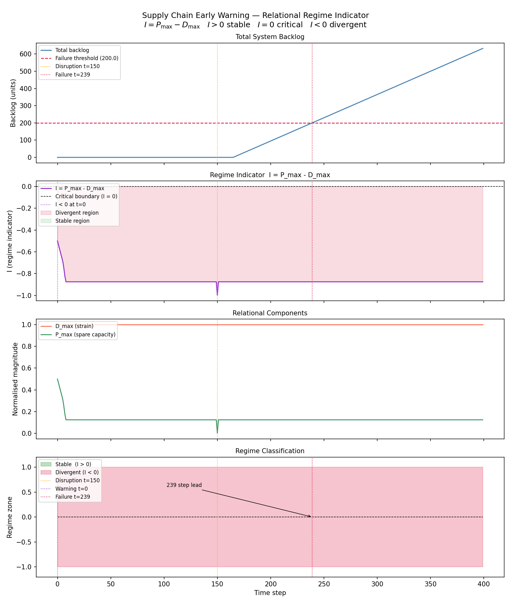

# Supply Chain Early Warning Demo

Discrete-time simulation of a small supply network demonstrating
structural early detection of cascading overload before failure.

The detection mechanism is the **relational regime indicator**:

```
I = P_max - D_max
```

| Symbol | Definition |
|--------|-----------|
| `D_max` | Maximum relational strain across all edges — flow in transit divided by throughput limit |
| `P_max` | Minimum normalised spare capacity across all nodes |
| `I`     | Regime indicator. Positive = stable, zero = critical, negative = divergent |

When `I` crosses zero the network is structurally divergent. This crossing
precedes observable backlog accumulation by a measurable lead time — providing
early warning without statistical inference, sliding windows, or tuning parameters.

---

## Network

- 3 suppliers → 4 warehouses → 5 retail nodes
- Edges carry goods with transport delay and throughput limits
- Total nominal demand: 72 units/step
- Total nominal production: 120 units/step (surplus under normal conditions)
- W1 is the critical bottleneck node: serves R1 and R2 with 32 units/step capacity

## Disruption

At t=150, warehouse W1 suffers a severe capacity drop (200 → 20).
Downstream retail nodes R1 and R2 begin accumulating backlog.
The cascade propagates as upstream suppliers continue producing
into a blocked network.

## Detection

The regime indicator `I = P_max - D_max` is computed directly from
network state at each timestep. When strain exceeds spare capacity,
`I` crosses zero — the system has entered the divergent regime.

This structural crossing precedes the backlog failure threshold by
a measurable lead time. See console output for the exact step count
under default parameters.

No thresholds to tune on the detection side. The mathematics
determines the regime.

## Results



Four panels:
1. **Total backlog** — conventional failure signal
2. **Regime indicator I** — zero crossing marks structural warning
3. **D_max and P_max** — relational components
4. **Regime classification** — stable / divergent zones with lead time annotated

---

## Run

```
pip install -e .
python experiments/run_demo.py
```

Results saved to `results/regime_early_warning.png`.

The notebook at `notebooks/demo.ipynb` reproduces the same analysis interactively.

## Dependencies

numpy, networkx, matplotlib

## Repository Structure

```
supply-chain-early-warning-demo/
├── experiments/
│   └── run_demo.py          — main simulation and plot script
├── notebooks/
│   └── demo.ipynb           — interactive walkthrough
├── sc_sim/
│   ├── network.py           — 3-4-5 supply network definition
│   ├── flow.py              — simulation loop, bounded update operator
│   ├── disruption.py        — capacity drop injection
│   └── instability.py       — regime indicator I = P_max - D_max
├── results/                 — generated plots
├── pyproject.toml
└── README.md
```

Note: `metrics.py` is deprecated and will be removed in a future release.
`compute_trigger_times` now lives in `instability.py`.

---

## Mathematical Background

The regime indicator is an instance of the invariant relational operator:

```
ΔM = clip(E - M, P_max)
```

where the stability boundary `I = P_max - D_max = 0` is the critical
threshold at which the bounded update can no longer absorb incoming strain.
This is the same structure that governs the bounded plasticity simulation —
the supply chain is one domain instantiation of a domain-independent
relational invariant.

See also: [Bounded Plasticity Simulation](https://github.com/Relational-Relativity-Corporation/bounded-plasticity-simulation)
